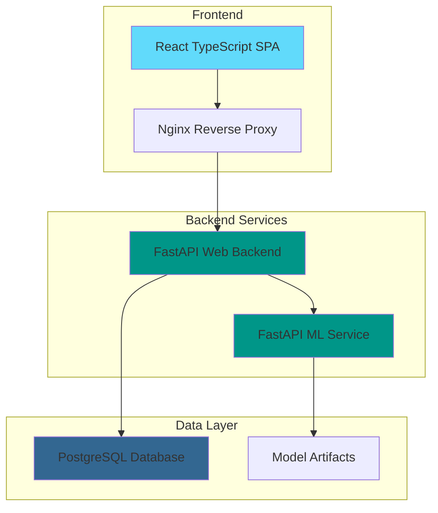

<h1 align="center">
  
</h1>

<p align="center">
  <strong>Building production-ready AI web applications with modern technology stacks</strong>
</p>

<p align="center">
  <a href="https://github.com/random-iceberg">
    
  </a>
  <a href="https://www.python.org/downloads/release/python-3130/">
    
  </a>
  <a href="https://reactjs.org/">
    
  </a>
  <a href="https://www.docker.com/">
    
  </a>
  <a href="https://fastapi.tiangolo.com/">
    
  </a>
  <a href="LICENSE">
    
  </a>
</p>

---

## 🚀 Featured Project: Titanic Survivor Prediction

**A production-ready web application that predicts Titanic passenger survival using machine learning models.**

### 🏗️ Architecture Overview



### ✨ Key Features

- 🤖 **5 ML Algorithms**: Random Forest, SVM, Decision Tree, KNN, Logistic Regression
- 🔐 **JWT Authentication**: Secure user registration and login
- 👨‍💼 **Admin Console**: Train, evaluate, and manage ML models
- 📱 **Mobile-First Design**: Responsive across all devices
- 🐳 **Containerized**: One-command deployment with Docker Compose
- ⚡ **Real-time Predictions**: Instant survival probability calculations
- 📊 **Prediction History**: Track and analyze user predictions
- 🎯 **Role-Based Access**: Anonymous, User, and Admin permission levels

### 🛠️ Technology Stack

| Category | Technologies |
|----------|-------------|
| **Frontend** | React 19, TypeScript, Tailwind CSS, Vite |
| **Backend** | FastAPI, Python 3.13, SQLAlchemy, Alembic |
| **ML/AI** | scikit-learn, pandas, NumPy |
| **Database** | PostgreSQL, pgAdmin |
| **DevOps** | Docker, Docker Compose, GitHub Actions |
| **Testing** | Pytest, React Testing Library, Playwright |

### 📁 Repository Structure

| Repository | Description | Tech Stack |
|------------|-------------|-----------|
| **[docker-compose](https://github.com/random-iceberg/docker-compose)** | 🏠 Main orchestration repository | Docker Compose, Nginx |
| **[web-frontend](https://github.com/random-iceberg/web-frontend)** | 🎨 React TypeScript frontend | React, TypeScript, Tailwind |
| **[web-backend](https://github.com/random-iceberg/web-backend)** | ⚙️ FastAPI web backend | FastAPI, PostgreSQL, JWT |
| **[model-backend](https://github.com/random-iceberg/model-backend)** | 🧠 ML inference service | FastAPI, scikit-learn |

### 🚀 Quick Start

> [!TIP]
> **Zero Configuration Deployment** - Get the entire application running with a single command!

```bash
# Clone the main repository
git clone --recurse-submodules https://github.com/random-iceberg/docker-compose.git
cd docker-compose

# Start all services
docker compose up --build -d

# Access the application
open http://localhost:8080
```

### 🎯 Project Highlights

> [!NOTE]
> This project was developed as part of **Software Engineering coursework** at **Deggendorf Institute of Technology (DIT)** and demonstrates enterprise-level development practices.

**What makes this project special:**

- ✅ **Production-Ready**: Full CI/CD pipeline, automated testing, health checks
- ✅ **Scalable Architecture**: Microservices design with clear separation of concerns
- ✅ **Security First**: JWT authentication, input validation, SQL injection prevention
- ✅ **Best Practices**: Clean code, comprehensive documentation, test coverage
- ✅ **Modern Stack**: Latest versions of React, FastAPI, Python, and PostgreSQL

### 👥 Team

**Team Random Iceberg** - Software Engineering students specializing in full-stack development and machine learning applications.

| Role | Responsibilities |
|------|-----------------|
| **Full-Stack Developers** | Frontend React development, UI/UX design, integration |
| **Backend Engineers** | FastAPI development, database design, authentication |
| **ML Engineers** | Model training, inference optimization, data preprocessing |
| **DevOps Engineers** | Containerization, CI/CD, deployment automation |

### 📊 Project Metrics

- **Lines of Code**: 12,000+
- **Test Coverage**: 80%+
- **Docker Services**: 4 containerized microservices
- **API Endpoints**: 20+ RESTful endpoints
- **Browser Support**: Chrome 119+, Firefox 122+, Safari 16.1+
- **Response Time**: <150ms prediction latency

### 🏆 Academic Achievement

> [!IMPORTANT]
> Successfully completed as part of **AIN-B Software Engineering** coursework under **Prof. Dr. Christoph Schober** at Deggendorf Institute of Technology.

---
<!-- 
## 🔗 Links

- **[Live Demo](http://localhost:8080)** (after local deployment)
- **[API Documentation](http://localhost:8080/api/docs)** (Swagger UI)
- **[Project Documentation](https://github.com/random-iceberg/docker-compose/tree/main/docs)**
 -->

## 📄 License

This project is licensed under the MIT License - see the [LICENSE](LICENSE) file for details.

---

<p align="center">
  <strong>Built with ❤️ by Team Random Iceberg</strong><br>
  <em>Showcasing modern web development and machine learning integration</em>
</p>
